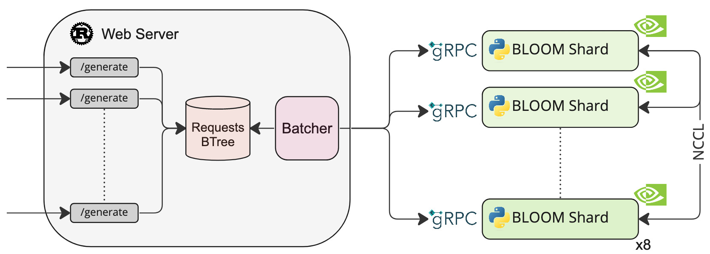

<div align="center">

# Text Generation Inference

<a href="https://github.com/huggingface/text-generation-inference">
  
</a>
<a href="https://github.com/huggingface/text-generation-inference/blob/main/LICENSE">
  
</a>
<a href="https://huggingface.github.io/text-generation-inference">
  
</a>



</div>

A Rust, Python and gRPC server for text generation inference. Used in production at [HuggingFace](https://huggingface.co) 
to power LLMs api-inference widgets.

## Table of contents

- [Features](#features)
- [Optimized Architectures](#optimized-architectures)
- [Get Started](#get-started)
  - [Docker](#docker)
  - [API Documentation](#api-documentation)
  - [A note on Shared Memory](#a-note-on-shared-memory-shm)
  - [Distributed Tracing](#distributed-tracing)
  - [Local Install](#local-install)
  - [CUDA Kernels](#cuda-kernels)
- [Run BLOOM](#run-bloom)
  - [Download](#download)
  - [Run](#run)
  - [Quantization](#quantization)
- [Develop](#develop)
- [Testing](#testing)

## Features

- Serve the most popular Large Language Models with a simple launcher
- Tensor Parallelism for faster inference on multiple GPUs
- Token streaming using Server-Sent Events (SSE)
- [Continuous batching of incoming requests](https://github.com/huggingface/text-generation-inference/tree/main/router) for increased total throughput
- Optimized transformers code for inference using [flash-attention](https://github.com/HazyResearch/flash-attention) and [Paged Attention](https://github.com/vllm-project/vllm) on the most popular architectures
- Quantization with [bitsandbytes](https://github.com/TimDettmers/bitsandbytes) and [GPT-Q](https://arxiv.org/abs/2210.17323)
- [Safetensors](https://github.com/huggingface/safetensors) weight loading
- Watermarking with [A Watermark for Large Language Models](https://arxiv.org/abs/2301.10226)
- Logits warper (temperature scaling, top-p, top-k, repetition penalty, more details see [transformers.LogitsProcessor](https://huggingface.co/docs/transformers/internal/generation_utils#transformers.LogitsProcessor))
- Stop sequences
- Log probabilities
- Production ready (distributed tracing with Open Telemetry, Prometheus metrics)

## Optimized architectures

- [BLOOM](https://huggingface.co/bigscience/bloom)
- [FLAN-T5](https://huggingface.co/google/flan-t5-xxl)
- [Galactica](https://huggingface.co/facebook/galactica-120b)
- [GPT-Neox](https://huggingface.co/EleutherAI/gpt-neox-20b)
- [Llama](https://github.com/facebookresearch/llama)
- [OPT](https://huggingface.co/facebook/opt-66b)
- [SantaCoder](https://huggingface.co/bigcode/santacoder)
- [Starcoder](https://huggingface.co/bigcode/starcoder)
- [Falcon 7B](https://huggingface.co/tiiuae/falcon-7b)
- [Falcon 40B](https://huggingface.co/tiiuae/falcon-40b)

Other architectures are supported on a best effort basis using:

`AutoModelForCausalLM.from_pretrained(<model>, device_map="auto")`

or

`AutoModelForSeq2SeqLM.from_pretrained(<model>, device_map="auto")`

## Get started

### Docker

The easiest way of getting started is using the official Docker container:

```shell
model=bigscience/bloom-560m
num_shard=2
volume=$PWD/data # share a volume with the Docker container to avoid downloading weights every run

docker run --gpus all --shm-size 1g -p 8080:80 -v $volume:/data ghcr.io/huggingface/text-generation-inference:0.9 --model-id $model --num-shard $num_shard
```
**Note:** To use GPUs, you need to install the [NVIDIA Container Toolkit](https://docs.nvidia.com/datacenter/cloud-native/container-toolkit/install-guide.html). We also recommend using NVIDIA drivers with CUDA version 11.8 or higher.

To see all options to serve your models (in the [code](https://github.com/huggingface/text-generation-inference/blob/main/launcher/src/main.rs) or in the cli:
```
text-generation-launcher --help
```

You can then query the model using either the `/generate` or `/generate_stream` routes:

```shell
curl 127.0.0.1:8080/generate \
    -X POST \
    -d '{"inputs":"What is Deep Learning?","parameters":{"max_new_tokens":17}}' \
    -H 'Content-Type: application/json'
```

```shell
curl 127.0.0.1:8080/generate_stream \
    -X POST \
    -d '{"inputs":"What is Deep Learning?","parameters":{"max_new_tokens":17}}' \
    -H 'Content-Type: application/json'
```

or from Python:

```shell
pip install text-generation
```

```python
from text_generation import Client

client = Client("http://127.0.0.1:8080")
print(client.generate("What is Deep Learning?", max_new_tokens=17).generated_text)

text = ""
for response in client.generate_stream("What is Deep Learning?", max_new_tokens=17):
    if not response.token.special:
        text += response.token.text
print(text)
```

### API documentation

You can consult the OpenAPI documentation of the `text-generation-inference` REST API using the `/docs` route.
The Swagger UI is also available at: [https://huggingface.github.io/text-generation-inference](https://huggingface.github.io/text-generation-inference).

### Distributed Tracing

`text-generation-inference` is instrumented with distributed tracing using OpenTelemetry. You can use this feature
by setting the address to an OTLP collector with the `--otlp-endpoint` argument.

### A note on Shared Memory (shm)

[`NCCL`](https://docs.nvidia.com/deeplearning/nccl/user-guide/docs/index.html) is a communication framework used by
`PyTorch` to do distributed training/inference. `text-generation-inference` make
use of `NCCL` to enable Tensor Parallelism to dramatically speed up inference for large language models.

In order to share data between the different devices of a `NCCL` group, `NCCL` might fall back to using the host memory if
peer-to-peer using NVLink or PCI is not possible.

To allow the container to use 1G of Shared Memory and support SHM sharing, we add `--shm-size 1g` on the above command.

If you are running `text-generation-inference` inside `Kubernetes`. You can also add Shared Memory to the container by
creating a volume with:

```yaml
- name: shm
  emptyDir:
   medium: Memory
   sizeLimit: 1Gi
```

and mounting it to `/dev/shm`.

Finally, you can also disable SHM sharing by using the `NCCL_SHM_DISABLE=1` environment variable. However, note that
this will impact performance.

### Local install

You can also opt to install `text-generation-inference` locally.

First [install Rust](https://rustup.rs/) and create a Python virtual environment with at least
Python 3.9, e.g. using `conda`:

```shell
curl --proto '=https' --tlsv1.2 -sSf https://sh.rustup.rs | sh

conda create -n text-generation-inference python=3.9 
conda activate text-generation-inference
```

You may also need to install Protoc.

On Linux:

```shell
PROTOC_ZIP=protoc-21.12-linux-x86_64.zip
curl -OL https://github.com/protocolbuffers/protobuf/releases/download/v21.12/$PROTOC_ZIP
sudo unzip -o $PROTOC_ZIP -d /usr/local bin/protoc
sudo unzip -o $PROTOC_ZIP -d /usr/local 'include/*'
rm -f $PROTOC_ZIP
```

On MacOS, using Homebrew:

```shell
brew install protobuf
```

Then run:

```shell
BUILD_EXTENSIONS=True make install # Install repository and HF/transformer fork with CUDA kernels
make run-bloom-560m
```

**Note:** on some machines, you may also need the OpenSSL libraries and gcc. On Linux machines, run:

```shell
sudo apt-get install libssl-dev gcc -y
```

### CUDA Kernels

The custom CUDA kernels are only tested on NVIDIA A100s. If you have any installation or runtime issues, you can remove 
the kernels by using the `BUILD_EXTENSIONS=False` environment variable.

Be aware that the official Docker image has them enabled by default.

## Run BLOOM

### Download

It is advised to download the weights ahead of time with the following command:

```shell
make download-bloom
```

### Run

```shell
make run-bloom # Requires 8xA100 80GB
```

### Quantization

You can also quantize the weights with bitsandbytes to reduce the VRAM requirement:

```shell
make run-bloom-quantize # Requires 8xA100 40GB
```

## Develop

```shell
make server-dev
make router-dev
```

## Testing

```shell
# python
make python-server-tests
make python-client-tests
# or both server and client tests
make python-tests
# rust cargo tests
make rust-tests
# integration tests
make integration-tests
```
