# Text Generation Inference - TensorRT-LLM Backend Implementation

## Description

This folder provides the sources of the TensorRT-LLM backend implementation powered by TensorRT-LLM Executor new API

## Simplified Request Sequence

```mermaid
sequenceDiagram
    actor User
    participant TextGenerationInference.HttpServer
    participant TextGenerationInference.TensorRtLlmBackend
    participant TextGenerationInference.TensorRtLlmWorkerThread
    participant TensorRtLlm.Executor
    participant Nvidia.Gpu
    User ->> TextGenerationInference.HttpServer: POST /generate
    TextGenerationInference.HttpServer ->> TextGenerationInference.TensorRtLlmBackend: Validate and forward inputs & parameters
    TextGenerationInference.TensorRtLlmBackend ->> TextGenerationInference.TensorRtLlmWorkerThread: Allocate a new context and spawn a new thread to handle the request
    TextGenerationInference.TensorRtLlmWorkerThread ->> TensorRtLlm.Executor: Submit the request to the In-Flight Batcher
    activate Nvidia.Gpu
    TensorRtLlm.Executor ->> Nvidia.Gpu: Add the request to the poll for execution
    TensorRtLlm.Executor -->> TextGenerationInference.TensorRtLlmWorkerThread: Response with an unique request identifier
    rect rgb(10, 92, 54)
        loop every 100us
            rect rgb(15, 81, 50)
                alt Acquire lock to query executor
                    TextGenerationInference.TensorRtLlmWorkerThread ->> TensorRtLlm.Executor: Poll request number of new token(s) generated
                else There are new generated tokens
                    TextGenerationInference.TensorRtLlmWorkerThread ->> TensorRtLlm.Executor: Retrieve newly generated tokens
                    TensorRtLlm.Executor -->> TextGenerationInference.TensorRtLlmWorkerThread: Return decoded token information and potential error (omitted)
                    rect rgb(11, 110, 79)
                        alt Generated token is final
                            TensorRtLlm.Executor ->> Nvidia.Gpu: Remove request from the scheduler and from the GPU
                            TextGenerationInference.TensorRtLlmWorkerThread -->> User: Stream the remaining decoded tokens and flush the connection
                        else Generated token is not final
                            TextGenerationInference.TensorRtLlmWorkerThread -->> User: Stream token back to the user as they get decoded
                        end
                    end
                end
            end
            deactivate Nvidia.Gpu
        end
    end

```

