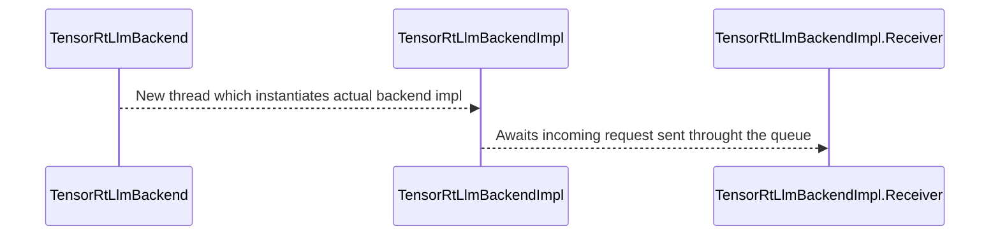

```mermaid
sequenceDiagram
    TensorRtLlmBackend -->> TensorRtLlmBackendImpl: New thread which instantiates actual backend impl
    TensorRtLlmBackendImpl -->> TensorRtLlmBackendImpl.Receiver: Awaits incoming request sent throught the queue
    
```