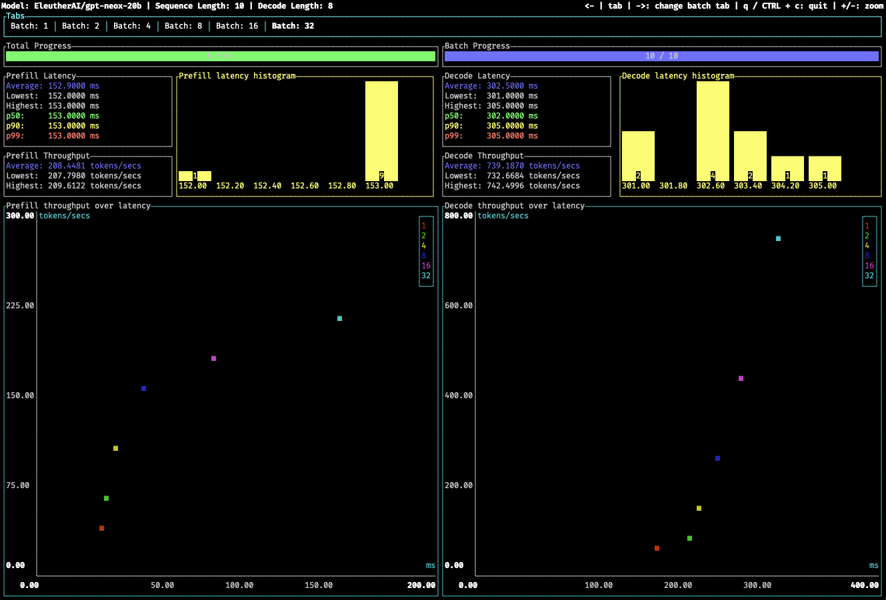

<div align="center">

# Text Generation Inference benchmarking tool



</div>

A lightweight benchmarking tool based inspired by [oha](https://github.com/hatoo/oha)
and powered by [Ratatui](https://github.com/ratatui/ratatui).

## Install

```shell
make install-benchmark
```

## Run

First, start `text-generation-inference`:

```shell
text-generation-launcher --model-id bigscience/bloom-560m
```

Then run the benchmarking tool:

```shell
text-generation-benchmark --tokenizer-name bigscience/bloom-560m
```
