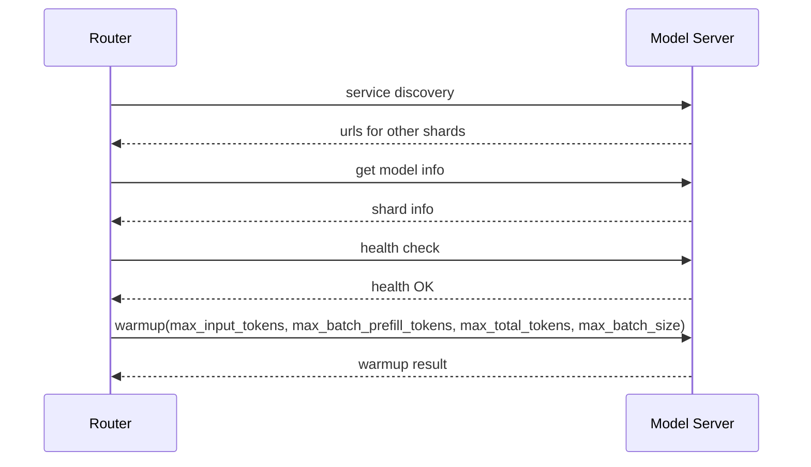
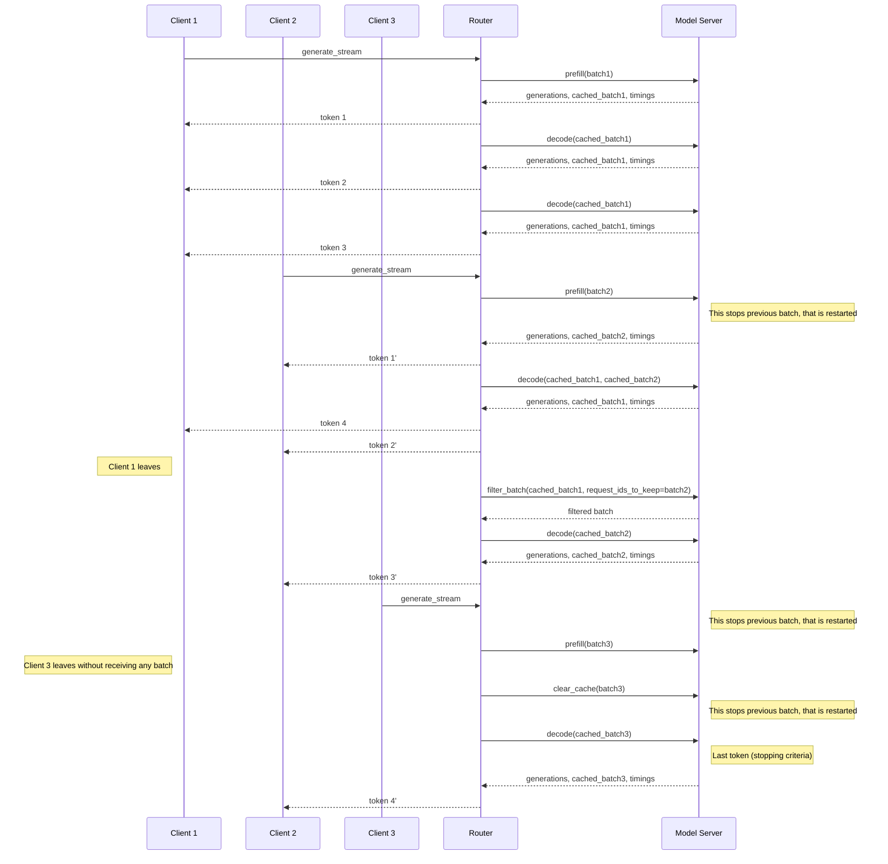

# Text Generation Inference Architecture

This document aims at describing the architecture of Text Generation Inference (TGI), by describing the call flow between the separate components.

A high-level architecture diagram can be seen here:


This diagram shows well there are these separate components:

- **The router**, also named `webserver`, that receives the client requests, buffers them, creates some batches, and prepares gRPC calls to a model server.
- **The model server**, responsible of receiving the gRPC requests and to process the inference on the model. If the model is sharded across multiple accelerators (e.g.: multiple GPUs), the model server shards might be synchronized via NCCL or equivalent.
- **The launcher** is a helper thar will be able to launch one or several model servers (if model is sharded), and it launches the router with the compatible arguments.

The router and the model server can be two different machines, they do not need to be deployed together.

## The Router

This component is a rust web server binary that accepts HTTP requests using the custom [HTTP API](https://huggingface.github.io/text-generation-inference/), as well as OpenAI's [Messages API](https://huggingface.co/docs/text-generation-inference/messages_api).
The router receives the API calls and handles the "baches" logic (and introduction to batching can be found [here](https://github.com/huggingface/text-generation-inference/blob/main/router/README.md)).
It uses different strategies to reduce latency between requests and responses, especially oriented to decoding latency. It will use queues, schedulers, and block allocators to achieve that and produce batched requests that it will then be sent to the model server.

### Router's command line

The router command line will be the way to pass parameters to it (it does not rely on configuration file):

```
Text Generation Webserver

Usage: text-generation-router [OPTIONS]

Options:
      --max-concurrent-requests <MAX_CONCURRENT_REQUESTS>
          [env: MAX_CONCURRENT_REQUESTS=] [default: 128]
      --max-best-of <MAX_BEST_OF>
          [env: MAX_BEST_OF=] [default: 2]
      --max-stop-sequences <MAX_STOP_SEQUENCES>
          [env: MAX_STOP_SEQUENCES=] [default: 4]
      --max-top-n-tokens <MAX_TOP_N_TOKENS>
          [env: MAX_TOP_N_TOKENS=] [default: 5]
      --max-input-tokens <MAX_INPUT_TOKENS>
          [env: MAX_INPUT_TOKENS=] [default: 1024]
      --max-total-tokens <MAX_TOTAL_TOKENS>
          [env: MAX_TOTAL_TOKENS=] [default: 2048]
      --waiting-served-ratio <WAITING_SERVED_RATIO>
          [env: WAITING_SERVED_RATIO=] [default: 1.2]
      --max-batch-prefill-tokens <MAX_BATCH_PREFILL_TOKENS>
          [env: MAX_BATCH_PREFILL_TOKENS=] [default: 4096]
      --max-batch-total-tokens <MAX_BATCH_TOTAL_TOKENS>
          [env: MAX_BATCH_TOTAL_TOKENS=]
      --max-waiting-tokens <MAX_WAITING_TOKENS>
          [env: MAX_WAITING_TOKENS=] [default: 20]
      --max-batch-size <MAX_BATCH_SIZE>
          [env: MAX_BATCH_SIZE=]
      --hostname <HOSTNAME>
          [env: HOSTNAME=] [default: 0.0.0.0]
  -p, --port <PORT>
          [env: PORT=] [default: 3000]
      --master-shard-uds-path <MASTER_SHARD_UDS_PATH>
          [env: MASTER_SHARD_UDS_PATH=] [default: /tmp/text-generation-server-0]
      --tokenizer-name <TOKENIZER_NAME>
          [env: TOKENIZER_NAME=] [default: bigscience/bloom]
      --tokenizer-config-path <TOKENIZER_CONFIG_PATH>
          [env: TOKENIZER_CONFIG_PATH=]
      --revision <REVISION>
          [env: REVISION=]
      --validation-workers <VALIDATION_WORKERS>
          [env: VALIDATION_WORKERS=] [default: 2]
      --json-output
          [env: JSON_OUTPUT=]
      --otlp-endpoint <OTLP_ENDPOINT>
          [env: OTLP_ENDPOINT=]
      --otlp-service-name <OTLP_SERVICE_NAME>
          [env: OTLP_SERVICE_NAME=]
      --cors-allow-origin <CORS_ALLOW_ORIGIN>
          [env: CORS_ALLOW_ORIGIN=]
      --ngrok
          [env: NGROK=]
      --ngrok-authtoken <NGROK_AUTHTOKEN>
          [env: NGROK_AUTHTOKEN=]
      --ngrok-edge <NGROK_EDGE>
          [env: NGROK_EDGE=]
      --messages-api-enabled
          [env: MESSAGES_API_ENABLED=]
      --disable-grammar-support
          [env: DISABLE_GRAMMAR_SUPPORT=]
      --max-client-batch-size <MAX_CLIENT_BATCH_SIZE>
          [env: MAX_CLIENT_BATCH_SIZE=] [default: 4]
  -h, --help
          Print help
  -V, --version
          Print version
```

## The Model Server

The model server is a python server, capable of starting a server waiting for gRPC requests, loads a given model, perform sharding to provide [tensor parallelism](https://huggingface.co/docs/text-generation-inference/conceptual/tensor_parallelism), and stays alive while waiting for new requests.
The model server supports models instantiated using Pytorch and optimized for inference mainly on CUDA/ROCM.

### Model Server Variants

Several variants of the model server exist that are actively supported by Hugging Face:

- By default, the model server will attempt building [a server optimized for Nvidia GPUs with CUDA](https://huggingface.co/docs/text-generation-inference/installation_nvidia). The code for this version is hosted in the [main TGI repository](https://github.com/huggingface/text-generation-inference).
- A [version optimized for AMD with ROCm](https://huggingface.co/docs/text-generation-inference/installation_amd) is hosted in the main TGI repository. Some model features differ.
- A [version optimized for Intel GPUs](https://huggingface.co/docs/text-generation-inference/installation_intel) is hosted in the main TGI repository. Some model features differ.
- The [version for Intel Gaudi](https://huggingface.co/docs/text-generation-inference/installation_gaudi) is maintained on a forked repository, often resynchronized with the main [TGI repository](https://github.com/huggingface/tgi-gaudi).
- A [version for Neuron (AWS Inferentia2)](https://huggingface.co/docs/text-generation-inference/installation_inferentia) is maintained as part of [Optimum Neuron](https://github.com/huggingface/optimum-neuron/tree/main/text-generation-inference).
- A version for Google TPUs is maintained as part of [Optimum TPU](https://github.com/huggingface/optimum-tpu/tree/main/text-generation-inference).

Not all variants provide the same features, as hardware and middleware capabilities do not provide the same optimizations.

### Command Line Interface

The official command line interface (CLI) for the server supports three subcommands, `download-weights`, `quantize` and `serve`:

- `download-weights` will download weights from the hub and, in some variants it will convert weights to a format that is adapted to the given implementation;
- `quantize` will allow to quantize a model using the `qptq` package. This feature is not available nor supported on all variants;
- `serve` will start the server that load a model (or a model shard), receives gRPC calls from the router, performs an inference and provides a formatted response to the given request.

Serve's command line parameters on the TGI repository are these:

```
 Usage: cli.py serve [OPTIONS] MODEL_ID

╭─ Arguments ──────────────────────────────────────────────────────────────────────────────────────────────╮
│ *    model_id      TEXT  [default: None] [required]                                                      │
╰──────────────────────────────────────────────────────────────────────────────────────────────────────────╯
╭─ Options ────────────────────────────────────────────────────────────────────────────────────────────────╮
│ --revision                                       TEXT                        [default: None]             │
│ --sharded              --no-sharded                                          [default: no-sharded]       │
│ --quantize                                       [bitsandbytes|bitsandbytes  [default: None]             │
│                                                  -nf4|bitsandbytes-fp4|gptq                              │
│                                                  |awq|eetq|exl2|fp8]                                     │
│ --speculate                                      INTEGER                     [default: None]             │
│ --dtype                                          [float16|bfloat16]          [default: None]             │
│ --trust-remote-code    --no-trust-remote-code                                [default:                   │
│                                                                              no-trust-remote-code]       │
│ --uds-path                                       PATH                        [default:                   │
│                                                                              /tmp/text-generation-serve… │
│ --logger-level                                   TEXT                        [default: INFO]             │
│ --json-output          --no-json-output                                      [default: no-json-output]   │
│ --otlp-endpoint                                  TEXT                        [default: None]             │
│ --otlp-service-name                              TEXT                        [default:                   │
│                                                                              text-generation-inference...│
│ --help                                                                       Show this message and exit. │
╰──────────────────────────────────────────────────────────────────────────────────────────────────────────╯
```

Note that some variants might support different parameters, and they could possibly accept more options that can be passed on using environment variables.

## Call Flow

Once both components are initialized, weights downloaded and model server is up and running, router and model server exchange data and info through the gRPC call. There are currently two supported schemas, [v2](https://github.com/huggingface/text-generation-inference/blob/main/proto/generate.proto) and [v3](https://github.com/huggingface/text-generation-inference/blob/main/proto/v3/generate.proto). These two versions are almost identical, except for:

- input chunks support, for text and image data,
- paged attention support

Here's a diagram that displays the exchanges that follow the router and model server startup.



After these are done, the router is ready to receive generate calls from multiple clients. Here's an example.


